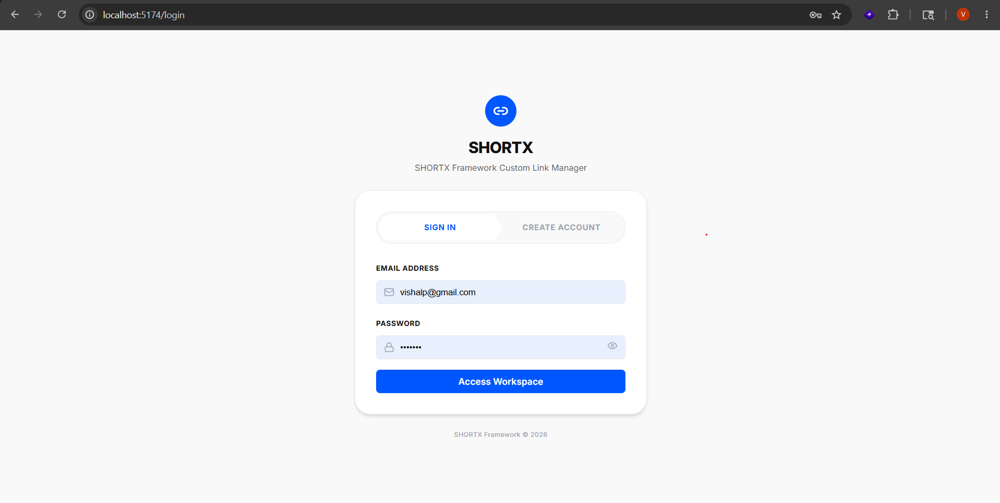
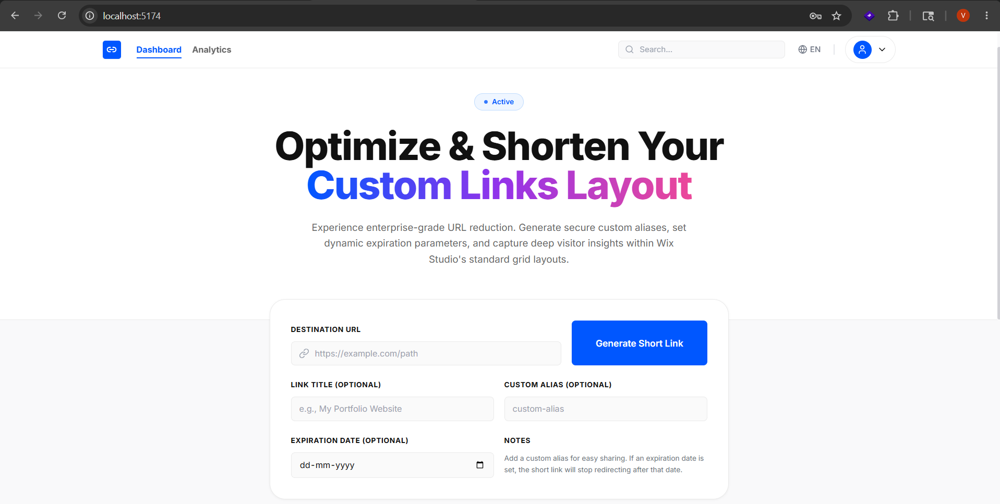
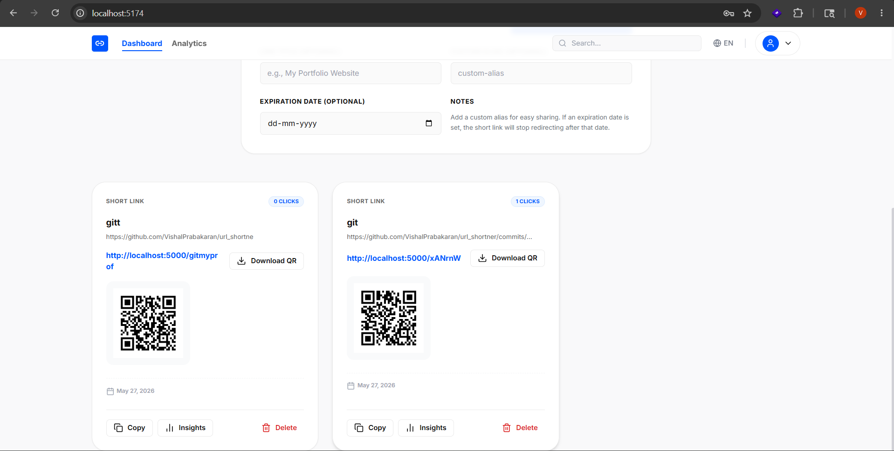
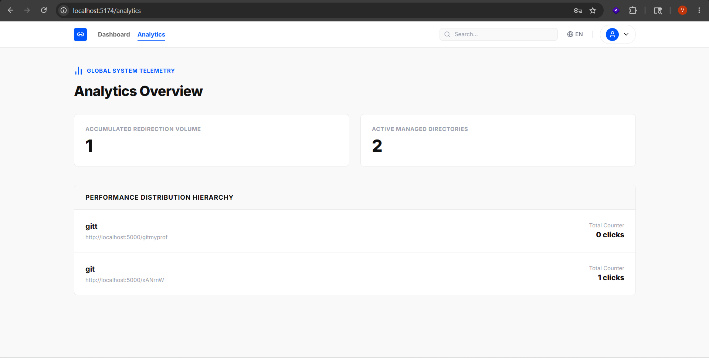
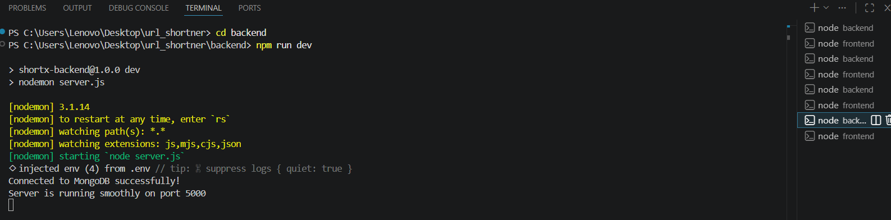
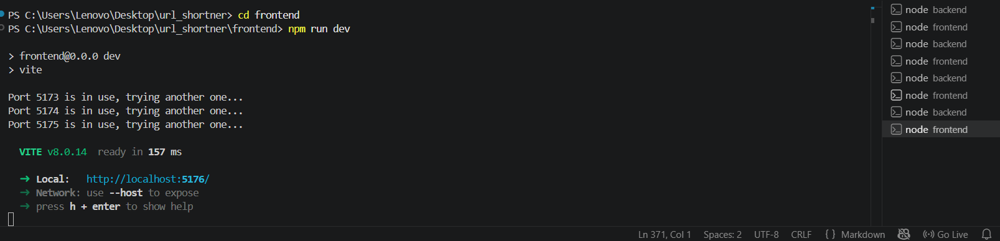
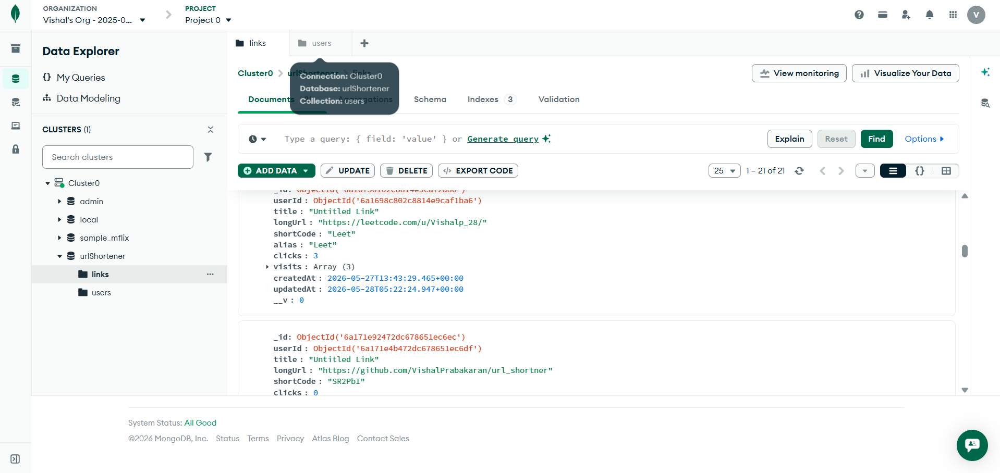
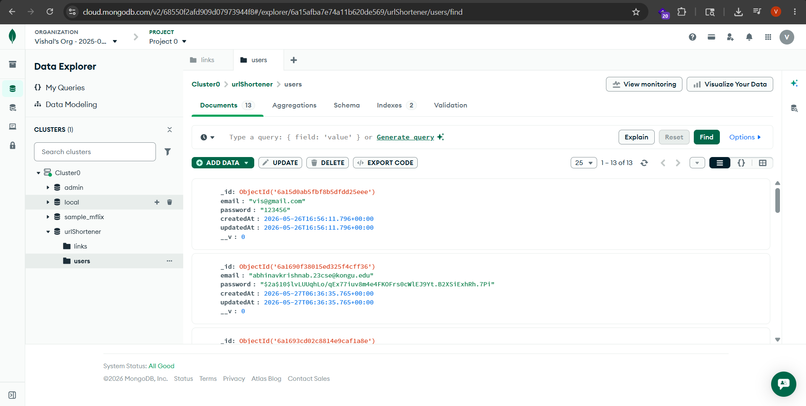

# SHORTX — AI Powered URL Shortener

SHORTX is a modern full-stack URL shortening platform that allows users to create, manage, and track shortened URLs with authentication and analytics support.

The application is built using React, Node.js, Express, and MongoDB with a responsive and modern dashboard interface.

---

# Live Deployment

## Frontend (Vercel)

Frontend Live URL:
https://vercel.com/vishalp2836-1760s-projects/url-shortner/H2MajDE8i5Sp4newExXNpYhSWHrL

## Backend (Render)

Backend API URL:
https://shortx-backend-pk5j.onrender.com

---

# Features

* User Authentication (JWT)
* URL Shortening
* Custom Alias Support
* Expiry Date Support
* Copy to Clipboard
* Redirect Handling
* Click Analytics
* Recent Visit Tracking
* Responsive Dashboard
* Secure REST APIs

---

# Tech Stack

| Layer          | Technology                   |
| -------------- | ---------------------------- |
| Frontend       | React.js, Vite, Tailwind CSS |
| Backend        | Node.js, Express.js          |
| Database       | MongoDB                      |
| Authentication | JWT                          |
| Deployment     | Vercel + Render              |

---

# Project Structure

```txt id="x7r2kq"
URL_SHORTENER/
│
├── backend/
│   ├── config/
│   │   └── db.js
│   ├── controllers/
│   │   ├── authController.js
│   │   ├── linkController.js
│   │   └── redirectController.js
│   ├── middleware/
│   │   └── authMiddleware.js
│   ├── models/
│   │   ├── link.js
│   │   └── user.js
│   ├── routes/
│   │   ├── authRoutes.js
│   │   ├── linkRoutes.js
│   │   └── redirectRoutes.js
│   ├── .env.example
│   ├── package.json
│   └── server.js
│
├── frontend/
│   ├── public/
│   ├── src/
│   │   ├── assets/
│   │   ├── components/
│   │   │   ├── ui/
│   │   │   ├── AnalyticsDrawer.jsx
│   │   │   ├── AuthPortal.jsx
│   │   │   ├── DeleteModal.jsx
│   │   │   ├── HeroSection.jsx
│   │   │   ├── LinkCard.jsx
│   │   │   ├── LinkGrid.jsx
│   │   │   ├── Navbar.jsx
│   │   │   ├── ProtectedRoute.jsx
│   │   │   └── ShortenerForm.jsx
│   │   ├── context/
│   │   ├── routes/
│   │   ├── services/
│   │   │   └── api.js
│   │   ├── App.jsx
│   │   ├── index.css
│   │   └── main.jsx
│   └── package.json
│
├── docs/
│   ├── ai_planning.md
│   ├── architecture.md
│   ├── features.md
│   ├── installation.md
│   └── planning.md
│
├── screenshots/
│   ├── analytics.png
│   ├── backend.png
│   ├── dashboard1.png
│   ├── dashboard2.png
│   ├── database1.png
│   ├── database2.png
│   ├── frontend.png
│   └── login.png
│
├── README.md
└── architecture.png
```

---

# Setup Instructions

## Prerequisites

* Node.js 18+
* MongoDB Atlas or Local MongoDB
* npm

---

# Backend Setup

```bash id="r3mbho"
cd backend
npm install
```

Create `.env` file inside backend folder:

```env id="0p3hso"
PORT=5000
MONGO_URI=your_mongodb_connection
JWT_SECRET=your_secret_key
BASE_URL=http://localhost:5000
```

Run backend server:

```bash id="sikx3m"
npm run dev
```

---

# Frontend Setup

```bash id="4y7u2r"
cd frontend
npm install
npm run dev
```

---

# Assumptions Made

* Users must authenticate before managing links.
* MongoDB is used for persistent storage.
* Analytics are limited to click counts and recent visit tracking.
* Expired links become inaccessible automatically.
* JWT is used for secure authentication.

---

# AI Planning Document

The application was developed using an AI-assisted workflow.

## Planning Steps

1. Defined project scope and core requirements.
2. Planned frontend and backend architecture.
3. Designed MongoDB schemas for users and links.
4. Created secure REST APIs.
5. Built responsive dashboard UI.
6. Added analytics tracking system.
7. Implemented JWT authentication.
8. Optimized frontend state management.
9. Tested redirect and analytics workflows.
10. Prepared deployment-ready structure.

## AI Tools Used

* ChatGPT
* Gemini
* GitHub Copilot
* Cursor AI

---

# Features Documentation

## Authentication

* User Signup
* User Login
* JWT Token Authorization
* Password Hashing using bcrypt

## URL Management

* Create Short URLs
* Custom Aliases
* Expiry Date Support
* Delete Links
* Copy Short URLs

## Analytics

* Click Tracking
* Recent Visit Records
* Creation Date Tracking

---

# Architecture Diagram


Example Flow:

```txt id="c6n4ej"
Frontend (React + Vite)
        ↓
Backend API (Express.js)
        ↓
MongoDB Database
```

---

# Screenshots

## Login Page



---

## Dashboard UI





---

## Analytics Dashboard



---

## Backend Preview



---

## Frontend Preview



---

## Database Collections





---

# Sample Outputs

## Backend Logs

```bash id="wzv6c3"
MongoDB Connected
Server running on port 5000
POST /api/auth/login 200
POST /api/links 201
GET /abc123 302 Redirect
```

## Database Entry

```json id="1hq7mr"
{
  "originalUrl": "https://google.com",
  "shortCode": "abc123",
  "clicks": 15
}
```

---

# Demo Video

Loom / YouTube Video Link:

https://www.loom.com/share/d73fc8782b074fefac8ff77a1034e81f

The video demonstrates:

* Authentication
* URL Creation
* Custom Aliases
* Expiry Dates
* Redirect Functionality
* Analytics Tracking
* Responsive Design
* Deployment Walkthrough

---

# Deployment Plan

## Frontend Deployment

Deploy using Vercel.

## Backend Deployment

Deploy using Render.

## Database

MongoDB Atlas Cloud Database.

---

# Future Enhancements

* QR Code Generation
* Advanced Analytics Dashboard
* Password Reset
* Redis Caching
* Rate Limiting
* Team Collaboration

---

# Contributing

1. Fork the repository
2. Create a feature branch
3. Commit changes
4. Push the branch
5. Open a pull request

---

# Hackathon Submission

This project was developed as part of a hackathon conducted by:

https://katomaran.com

---
