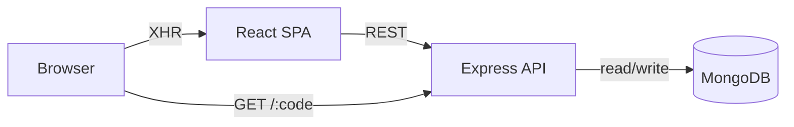

# Architecture

SHORTX follows a simple three-tier architecture:

- Frontend: React (Vite) SPA that provides pages for auth, link creation, dashboard, and analytics.
- Backend: Express.js API handling auth, link CRUD, and redirect logic.
- Database: MongoDB storing users and links.

## Component responsibilities
- Frontend
  - `src/services/api.js`: centralizes API calls and token handling
  - Components: `ShortenerForm`, `LinkGrid`, `LinkCard`, `AnalyticsDrawer`
- Backend
  - `routes/`: defines endpoints for auth, links, and redirect
  - `controllers/`: business logic for each route
  - `models/`: Mongoose schemas for User and Link
  - `middleware/authMiddleware.js`: verifies JWT and attaches user to request

## Sequence (create + redirect)
1. User submits URL to `POST /api/links` (protected)
2. Backend validates, creates `Link` document with `shortCode`
3. Frontend lists created link in dashboard
4. Visitor requests `GET /:shortCode`
5. Backend looks up link, increments `clicks`, appends visit record, and issues a 302 redirect

## Diagram

## Deployment notes
- In production, serve the built frontend from a static host or via Express static middleware.
- Use environment variables for `MONGO_URI`, `JWT_SECRET`, and `BASE_URL`.
- Use TLS/HTTPS in production to protect tokens and data in transit.

## Request Flow

### URL Creation Flow

1. User submits URL from frontend
2. React frontend sends request to Express API
3. Backend validates URL and generates short code
4. MongoDB stores link document
5. API returns shortened URL to frontend

### Redirect Flow

1. Visitor opens shortened URL
2. Express backend searches MongoDB
3. Click analytics updated
4. User redirected to original URL
