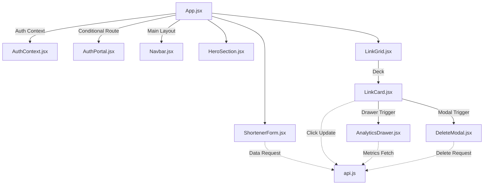

# TECHNICAL ARCHITECTURE GUIDE

This document explains the file structure, component hierarchy, state flow, and database integration layer of the SHORTX application.

---

## File Structure & Path Mapping

```text
url_shorter/
├── docs/                             # Documentation for Officials & Devs
│   ├── executive_summary.md
│   ├── architecture.md
│   └── installation.md
└── frontend/
    ├── src/
    │   ├── assets/                   # Static media assets
    │   ├── components/               # High-Fidelity UI elements
    │   │   ├── AuthPortal.jsx        # Login / Sign-up Card with mesh background
    │   │   ├── Navbar.jsx            # Wix Studio Top Header Navigation & Search
    │   │   ├── HeroSection.jsx       # Large centered typography title panel
    │   │   ├── ShortenerForm.jsx     # Dest URL input & advanced accordion fields
    │   │   ├── LinkCard.jsx          # Individual link metadata & controls
    │   │   ├── LinkGrid.jsx          # Shimmer skeletons & card container deck
    │   │   ├── DeleteModal.jsx       # Soft backdrop warning modal
    │   │   └── AnalyticsDrawer.jsx   # Slide-out Recharts analytics view
    │   ├── context/
    │   │   └── AuthContext.jsx       # React Auth Provider & hooks
    │   ├── services/
    │   │   └── api.js                # API client with localStorage DB fallback
    │   ├── App.jsx                   # Layout manager & root coordinator
    │   ├── main.jsx                  # React DOM anchor
    │   └── index.css                 # Base Tailwind imports & grid variables
    ├── index.html                    # Root index template with Google Inter Font
    ├── postcss.config.js             # PostCSS configurations for Tailwind v4
    ├── tailwind.config.js            # Tailwind custom colors & fonts
    ├── vite.config.js                # Vite build setups
    └── package.json                  # Dependencies
```

---

## Component Interactions



---

## State Architecture

- **Global Context (`AuthContext.jsx`)**: Coordinates user session variables (`user` object and `token` string) using `localStorage` caching to remain persistent across browser reloads.
- **Top-Level Dashboard State (`App.jsx`)**:
  - `links`: Stores the loaded array of link configurations.
  - `searchTerm`: Captures text filters entered in the Navbar search box to dynamically filter `links` based on title, target, alias, or short URL.
  - `selectedLinkForAnalytics`: A pointer to the link item whose performance details are visible in the sliding drawer.
  - `linkToDelete`: A pointer to the link item slated for deletion inside the confirmation modal.
- **Form State (`ShortenerForm.jsx`)**: Manages inputs for the destination URL, collapsible toggle, alias tags, and validation alerts.
- **Analytics State (`AnalyticsDrawer.jsx`)**: Dynamically triggers a backend/local fetch for click distributions and visitor tables whenever a new `linkId` is passed down.
